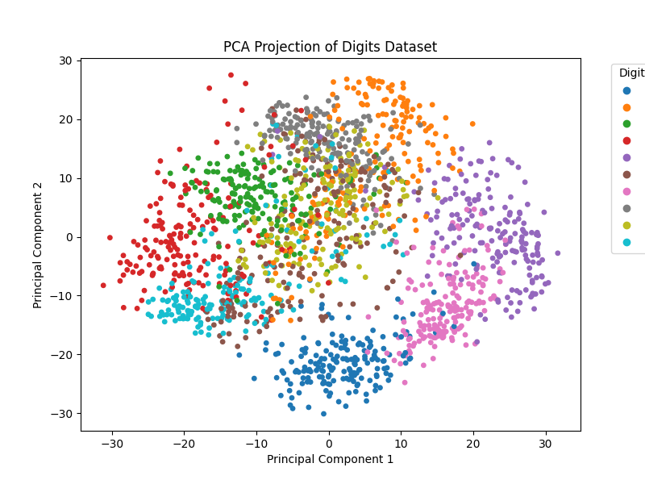

# 🔢 Digits Classification with PCA & KNN

[](https://www.python.org/)
[](https://scikit-learn.org/)

---

## 📚 Overview

This project demonstrates dimensionality reduction using **Principal Component Analysis (PCA)** and classification using **K-Nearest Neighbors (KNN)** on the classic **Digits dataset**.  
It visualizes the dataset in 2D using PCA and evaluates KNN classification accuracy on the reduced data.

---

## 📂 Project Structure

```
Digits_PCA_knn/
│── digits_pca_knn.py   # Main Python script
│── digits_pca.png      # PCA visualization of digits
│── README.md           # Project documentation
```

---

## 🚀 How to Run

1. **Navigate to the project folder:**
   ```sh
   cd Digits_PCA_knn
   ```
2. **Run the script:**
   ```sh
   python digits_pca_knn.py
   ```
3. **View the results:**
   - Console will print KNN accuracy with PCA-reduced features.
   - PCA visualization saved as `digits_pca.png`.

---

## ✅ Example Output

**Console:**

```
KNN Accuracy with PCA: 0.56
```

**PCA Visualization:**  
Shows the digits dataset projected onto two principal components.



---

## 🧠 Key Learnings

- **PCA** reduces high-dimensional data to lower dimensions for visualization and faster computation.
- **KNN** can be applied to reduced feature spaces, but accuracy may drop if too much information is lost.
- Visualizing data helps understand class separability after dimensionality reduction.

---

## 💡 Pro Tip

Try increasing the number of PCA components or tuning `n_neighbors` in KNN for better accuracy.

---

**Happy Learning! 🚀**
