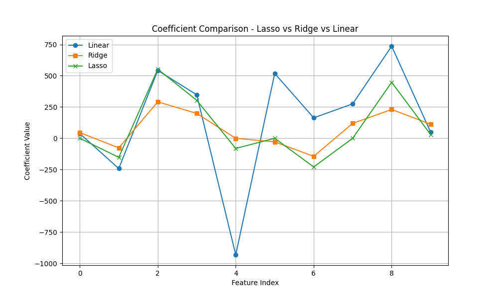

# 🧬 Feature Selection & Regularization – Diabetes Dataset

[](https://www.python.org/)
[](https://scikit-learn.org/)

---

## 📚 Overview

This project demonstrates the impact of **regularization** on feature selection and model performance using the classic **Diabetes dataset**.  
It compares **Linear Regression**, **Ridge Regression**, and **Lasso Regression** in terms of mean squared error and coefficient shrinkage.

---

## 📂 Project Structure

```
Feature_Selection_Regularization/
│── regularization_models.py      # Main Python script
│── regularization_comparison.png # Coefficient comparison plot
│── README.md                     # Project documentation
```

---

## 🚀 How to Run

1. **Navigate to the project folder:**
   ```sh
   cd Feature_Selection_Regularization
   ```
2. **Run the script:**
   ```sh
   python regularization_models.py
   ```
3. **View the results:**
   - Console will print mean squared error (MSE) for each model.
   - Coefficient comparison plot saved as `regularization_comparison.png`.

---

## ✅ Example Output

**Console:**

```
Linear Regression MSE: 2939.32
Ridge Regression MSE: 2937.38
Lasso Regression MSE: 2965.92
```

**Coefficient Comparison Plot:**  
Shows how regularization affects feature selection and coefficient values.



---

## 🧠 Key Learnings

- **Linear Regression:** Uses all features, may overfit if features are irrelevant.
- **Ridge Regression:** Shrinks coefficients, reduces overfitting, keeps all features.
- **Lasso Regression:** Shrinks some coefficients to zero, performs feature selection.
- Regularization helps improve model generalization and interpretability.

---

## 💡 Pro Tip

Try tuning the `alpha` parameter for Ridge and Lasso to see its effect on coefficients and model performance.

---

**Happy Learning! 🚀**
