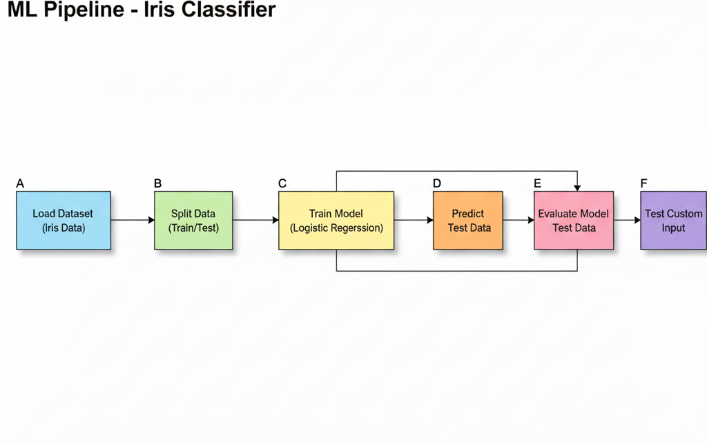

# 🌸 Iris Classifier – ML Pipeline

This project demonstrates a complete Machine Learning pipeline using the famous Iris dataset.  
It includes data preprocessing, model training, evaluation, and visualization of the pipeline flow.

---

## 📌 Project Overview

- Loads the Iris dataset from scikit-learn.
- Splits the data into training & testing sets.
- Applies Logistic Regression for classification.
- Evaluates model accuracy.
- Generates a flowchart of the ML pipeline for better understanding.

**Project Structure:**

```
scikit-learn-projects/
└── iris_classifier/
    ├── iris_classifier.py    # Main Python script
    └── README.md             # Project documentation
```

---

## 🚀 How to Run

1. **Clone the repo (or place files in your local system):**

   ```sh
   cd scikit-learn-projects
   ```

2. **Install dependencies:**

   ```sh
   pip install scikit-learn matplotlib graphviz
   ```

3. **Run the classifier:**

   ```sh
   python iris_classifier.py
   ```

4. **View the ML pipeline flowchart:**
   - Open `iris_ml_pipeline.png` in your project folder.

---

## 📊 Output Example

**Console Output:**

```
Model Accuracy: 0.97
```

**ML Pipeline Flowchart:**  
Below is a visualization of the pipeline steps.  


---

## 🔧 Technologies Used

- Python 🐍
- scikit-learn
- matplotlib
- graphviz

---

## 📖 Learnings

- Basics of ML model training
- Data preprocessing and splitting
- Evaluating models with accuracy score
- Creating visual ML pipeline flowcharts
