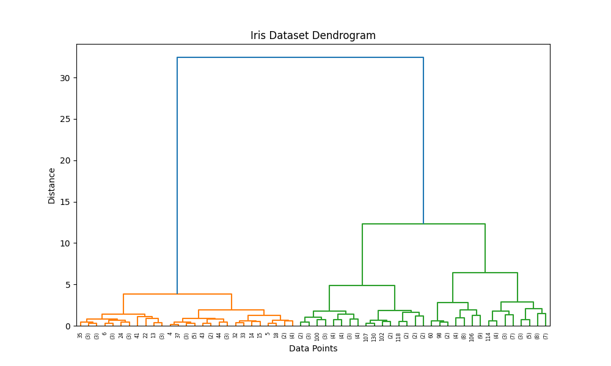
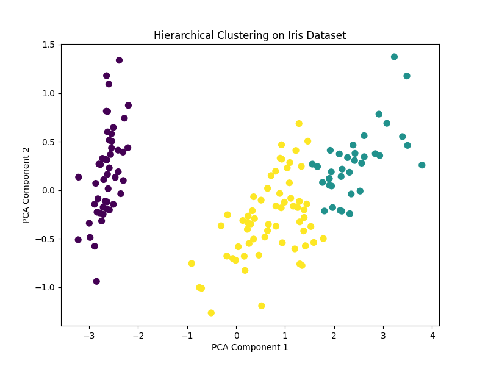

# 🌿 Iris Hierarchical Clustering

[](https://www.python.org/)
[](https://scikit-learn.org/)

---

## 📚 Overview

This project demonstrates **Hierarchical Clustering** on the classic **Iris dataset**.  
It visualizes the clustering process using a dendrogram and displays the resulting clusters in 2D space using **Principal Component Analysis (PCA)**.

---

## 📂 Project Structure

```
Iris_Hierarchical/
│── iris_hierarchical.py   # Main Python script
│── iris_dendrogram.png    # Dendrogram visualization
│── iris_clusters.png      # Cluster visualization in PCA space
│── README.md              # Project documentation
```

---

## 🚀 How to Run

1. **Navigate to the project folder:**
   ```sh
   cd Iris_Hierarchical
   ```
2. **Run the script:**
   ```sh
   python iris_hierarchical.py
   ```
3. **View the results:**
   - Console will display dendrogram and cluster visualizations.
   - Dendrogram saved as `iris_dendrogram.png`.
   - Cluster plot saved as `iris_clusters.png`.

---

## ✅ Example Output

**Dendrogram:**  
Shows how data points are merged into clusters at different distances.



**Cluster Visualization:**  
Displays the Iris dataset projected onto two principal components, colored by cluster assignment.



---

## 🧠 Key Learnings

- **Hierarchical clustering** builds a tree of clusters, visualized by a dendrogram.
- **Ward linkage** minimizes variance within clusters.
- **PCA** helps visualize high-dimensional clustering results in 2D.

---

## 💡 Pro Tip

Try changing the number of clusters or linkage method to explore different clustering behaviors.

---

**Happy Learning! 🚀**
