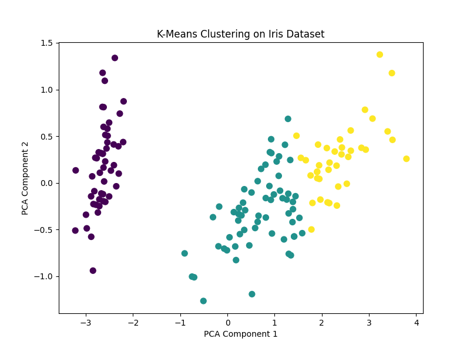

# 🌼 Iris Clustering with K-Means

[](https://www.python.org/)
[](https://scikit-learn.org/)

---

## 📚 Overview

This project applies **K-Means clustering** to the classic **Iris dataset** to group flowers into clusters without using their true labels.  
It evaluates clustering accuracy by mapping clusters to actual classes and visualizes the results using **Principal Component Analysis (PCA)**.

---

## 📂 Project Structure

```
Iris_Kmeans/
│── iris_kmeans.py      # Main Python script
│── iris_kmeans.png     # Visualization of clustered data
│── README.md           # Project documentation
```

---

## 🚀 How to Run

1. **Navigate to the project folder:**
    ```sh
    cd Iris_Kmeans
    ```
2. **Run the script:**
    ```sh
    python iris_kmeans.py
    ```
3. **View the results:**
    - Console will print K-Means clustering accuracy.
    - Cluster visualization saved as `iris_kmeans.png`.

---

## ✅ Example Output

**Console:**
```
K-Means Clustering Accuracy: 0.89
```

**Cluster Visualization:**  
Shows the Iris dataset projected onto two principal components and colored by cluster assignment.



---

## 🧠 Key Learnings

- **K-Means** can discover natural groupings in data without supervision.
- **Cluster labels** may not match true labels; mapping is needed for accuracy evaluation.
- **PCA** helps visualize high-dimensional clustering results in 2D.

---

## 💡 Pro Tip

Try changing the number of clusters or using different datasets to explore clustering behavior.

---

**Happy Learning! 🚀**