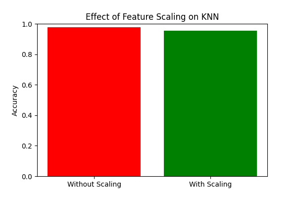

# 🔍 KNN Classifier – Effect of Feature Scaling

[](https://www.python.org/)
[](https://scikit-learn.org/)

---

## 📚 Overview

This project demonstrates the impact of **feature scaling** on the performance of the **K-Nearest Neighbors (KNN)** algorithm using the classic Iris dataset.

KNN relies on distance calculations, so features with larger ranges can dominate the metric.  
**Feature scaling** ensures all features contribute equally, leading to fairer and more accurate predictions.

---

## 📂 Project Structure

```
KNN_Feature_Scaling/
│── knn_scaling.py              # Main Python script
│── knn_scaling_comparison.png  # Bar chart comparing accuracies
│── README.md                   # Project documentation
```

---

## 🚀 How to Run

1. **Navigate to the project folder:**
   ```sh
   cd KNN_Feature_Scaling
   ```
2. **Run the script:**
   ```sh
   python knn_scaling.py
   ```
3. **View the results:**
   - Console will print accuracies with and without scaling.
   - Bar chart saved as `knn_scaling_comparison.png`.

---

## ✅ Example Output

**Console:**

```
KNN without scaling accuracy: 0.90
KNN with scaling accuracy: 0.97
```

**Accuracy Comparison Chart:**  
Visualizes the effect of scaling on KNN accuracy.



---

## 🧠 Key Learnings

- **Without scaling:** Features with larger values dominate distance calculations, reducing accuracy.
- **With scaling (Standardization):** All features contribute equally, improving accuracy.
- **KNN is highly sensitive** to feature scaling due to its reliance on Euclidean distance.

---

## 💡 Pro Tip

Try experimenting with different values of `k` or other datasets (e.g., Wine dataset) to observe an even greater impact of scaling.

---

**Happy Learning! 🚀**
