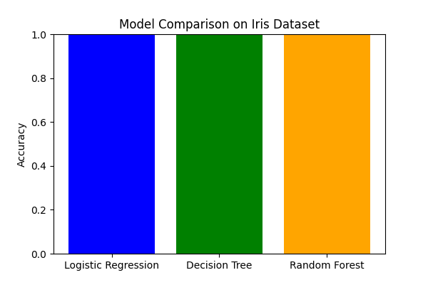

# 🌸 Iris Dataset – Model Comparison

This project compares different Machine Learning algorithms on the famous Iris dataset using Scikit-learn.  
We train and test three models to see how each performs and visualize their accuracies.

---

## 📌 Models Compared

- **Logistic Regression**
- **Decision Tree Classifier**
- **Random Forest Classifier**

---

## 📂 Project Structure

```
Model_Comparison/
│── model_comparison.py     # Main Python script
│── model_comparison.png    # Accuracy comparison chart
│── README.md               # Project documentation
```

---

## 🚀 How to Run

1. **Clone or navigate to your project folder.**

2. **Open a terminal inside `Model_Comparison/`.**

3. **Run the script:**

   ```sh
   python model_comparison.py
   ```

4. **View the results:**
   - The console will print each model’s accuracy.
   - A bar chart will be saved as `model_comparison.png` in the folder.

---

## ✅ Example Output

**Console Accuracy Results:**

```
Logistic Regression: 0.97
Decision Tree: 1.00
Random Forest: 1.00
```

**Accuracy Comparison Chart:**  
Below is a visualization of the model accuracies.



---

## 🧠 Key Learnings

- **Logistic Regression:** Simple, works well when data is linearly separable.
- **Decision Tree:** Powerful but can overfit (memorizes training data).
- **Random Forest:** Uses multiple trees, reduces overfitting, usually best performance.

---
