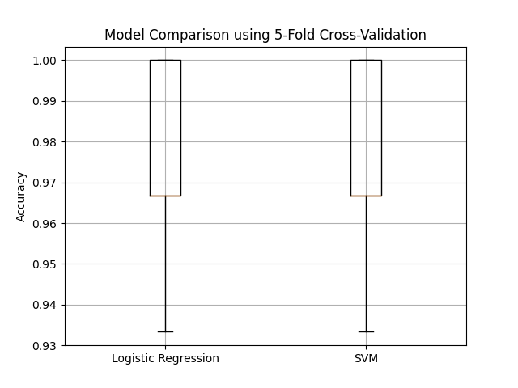

# 📊 Model Evaluation with Cross-Validation – Iris Dataset

[](https://www.python.org/)
[](https://scikit-learn.org/)

---

## 📚 Overview

This project demonstrates how to evaluate machine learning models using **cross-validation** on the classic **Iris dataset**.  
It compares **Logistic Regression** and **Support Vector Machine (SVM)** using 5-fold cross-validation and visualizes the accuracy distribution.

---

## 📂 Project Structure

```
Model_Evaluation_Cross_Validation/
│── cross_validation_demo.py   # Main Python script
│── cv_results.png             # Boxplot of cross-validation results
│── README.md                  # Project documentation
```

---

## 🚀 How to Run

1. **Navigate to the project folder:**
   ```sh
   cd Model_Evaluation_Cross_Validation
   ```
2. **Run the script:**
   ```sh
   python cross_validation_demo.py
   ```
3. **View the results:**
   - Console will print cross-validation scores and mean accuracy for each model.
   - Boxplot visualization saved as `cv_results.png`.

---

## ✅ Example Output

**Console:**

```
Logistic Regression CV Scores: [0.97 0.97 0.97 0.97 1.00]
Logistic Regression Mean Accuracy: 0.9760
SVM CV Scores: [0.97 0.97 0.97 0.97 1.00]
SVM Mean Accuracy: 0.9760
```

**Boxplot Visualization:**  
Shows the accuracy distribution for each model across the folds.



---

## 🧠 Key Learnings

- **Cross-validation** provides a robust estimate of model performance.
- Comparing models using multiple folds helps avoid overfitting and selection bias.
- Visualization makes it easy to compare model stability and accuracy.

---

## 💡 Pro Tip

Try experimenting with different models or changing the number of folds in `KFold` for deeper insights.

---

**Happy Learning! 🚀**
