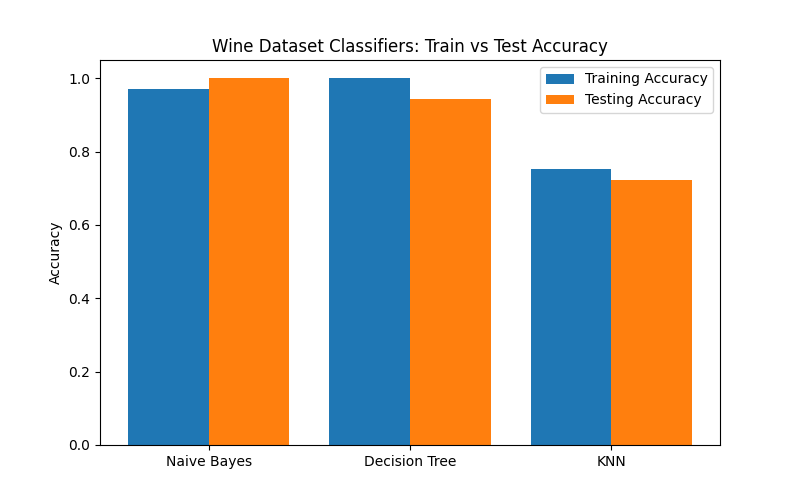

# 🍷 Naive Bayes Classifier – Wine Dataset

[](https://www.python.org/)
[](https://scikit-learn.org/)

---

## 📚 Overview

This project demonstrates the use of **Naive Bayes** and compares it with **Decision Tree** and **K-Nearest Neighbors (KNN)** classifiers on the classic **Wine dataset**.  
It covers model training, accuracy evaluation, and visualization of training vs testing accuracy for each algorithm.

---

## 📂 Project Structure

```
Naive_Bayes_Classifier/
│── naive_bayes.py                  # Main Python script
│── wine_classifiers_comparison.png # Bar chart comparing accuracies
│── README.md                       # Project documentation
```

---

## 🚀 How to Run

1. **Navigate to the project folder:**
   ```sh
   cd Naive_Bayes_Classifier
   ```
2. **Run the script:**
   ```sh
   python naive_bayes.py
   ```
3. **View the results:**
   - Console will print training and testing accuracies for each classifier.
   - Bar chart saved as `wine_classifiers_comparison.png`.

---

## ✅ Example Output

**Console:**

```
Naive Bayes: Train Accuracy = 0.98, Test Accuracy = 0.97
Decision Tree: Train Accuracy = 1.00, Test Accuracy = 0.94
KNN: Train Accuracy = 0.77, Test Accuracy = 0.69
```

**Accuracy Comparison Chart:**  
Visualizes training and testing accuracy for each classifier.



---

## 🧠 Key Learnings

- **Naive Bayes:** Simple, fast, and effective for many datasets.
- **Decision Tree:** Can overfit, especially on small datasets.
- **KNN:** Sensitive to feature scaling and value of k.
- Comparing multiple models helps identify the best approach for a given dataset.

---

## 💡 Pro Tip

Try experimenting with other classifiers or tuning hyperparameters to further improve accuracy.

---

**Happy Learning! 🚀**
