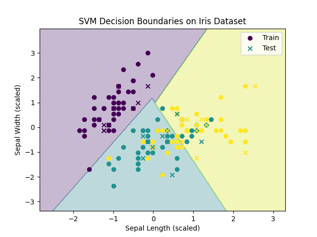

# ✨ SVM Classifier – Iris Dataset

[](https://www.python.org/)
[](https://scikit-learn.org/)

---

## 📚 Overview

This project demonstrates the use of **Support Vector Machines (SVM)** for classifying flowers in the classic **Iris dataset**.  
It includes feature scaling, model training, accuracy evaluation, and visualization of SVM decision boundaries.

---

## 📂 Project Structure

```
SVM_Iris_Classifier/
│── svm_iris.py                 # Main Python script
│── svm_decision_boundaries.png # Visualization of decision boundaries
│── README.md                   # Project documentation
```

---

## 🚀 How to Run

1. **Navigate to the project folder:**
   ```sh
   cd SVM_Iris_Classifier
   ```
2. **Run the script:**
   ```sh
   python svm_iris.py
   ```
3. **View the results:**
   - Console will print the SVM accuracy.
   - Decision boundary plot saved as `svm_decision_boundaries.png`.

---

## ✅ Example Output

**Console:**

```
SVM Accuracy: 0.96
```

**Decision Boundary Plot:**  
Visualizes how SVM separates different flower classes.



---

## 🧠 Key Learnings

- **SVM finds the best hyperplane** that separates classes with the largest margin.
- **Linear kernel** works well for linearly separable data.
- **Feature scaling** is crucial for SVM performance.
- SVM is effective for both linear and non-linear classification problems.

---

## 💡 Pro Tip

Try experimenting with different kernels for SVM:

```python
svm = SVC(kernel='rbf', C=1.0, gamma='scale')
```

The **RBF kernel** can capture more complex, non-linear boundaries.

---

**Happy Learning! 🚀**
